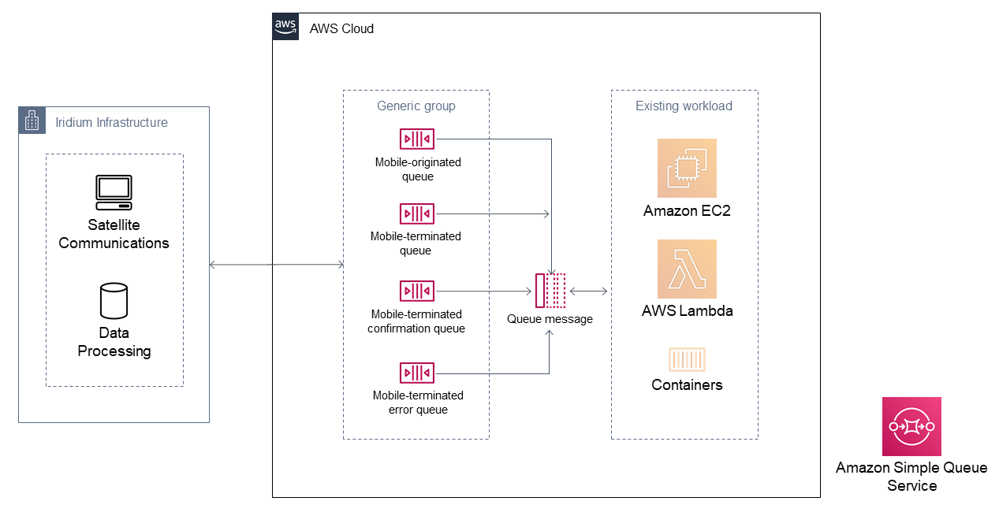

Deploying this Quick Start with default parameters builds the following {partner-product-short-name} environment in the
AWS Cloud.

// Replace this example diagram with your own. Send us your source PowerPoint file. Be sure to follow our guidelines here : http://(we should include these points on our contributors giude)
:xrefstyle: short
[#architecture1]
.Quick Start architecture for _{partner-product-short-name}_ on AWS
[link=images/architecture_diagram.png]

As shown in <<architecture1>>, the Quick Start sets up the following in your existing AWS virtual private cloud (VPC):

* Amazon SQS to provide a highly available queueing service for Iridium SBD messages. This deployment configures the following queues:
** Mobile-originated
** Mobile-terminated
** Mobile-terminated confirmation
** Mobile-terminated error
* An AWS Identity and Access Management (IAM) role and policy to set up Iridium CloudConnect cross-account authentication. 
